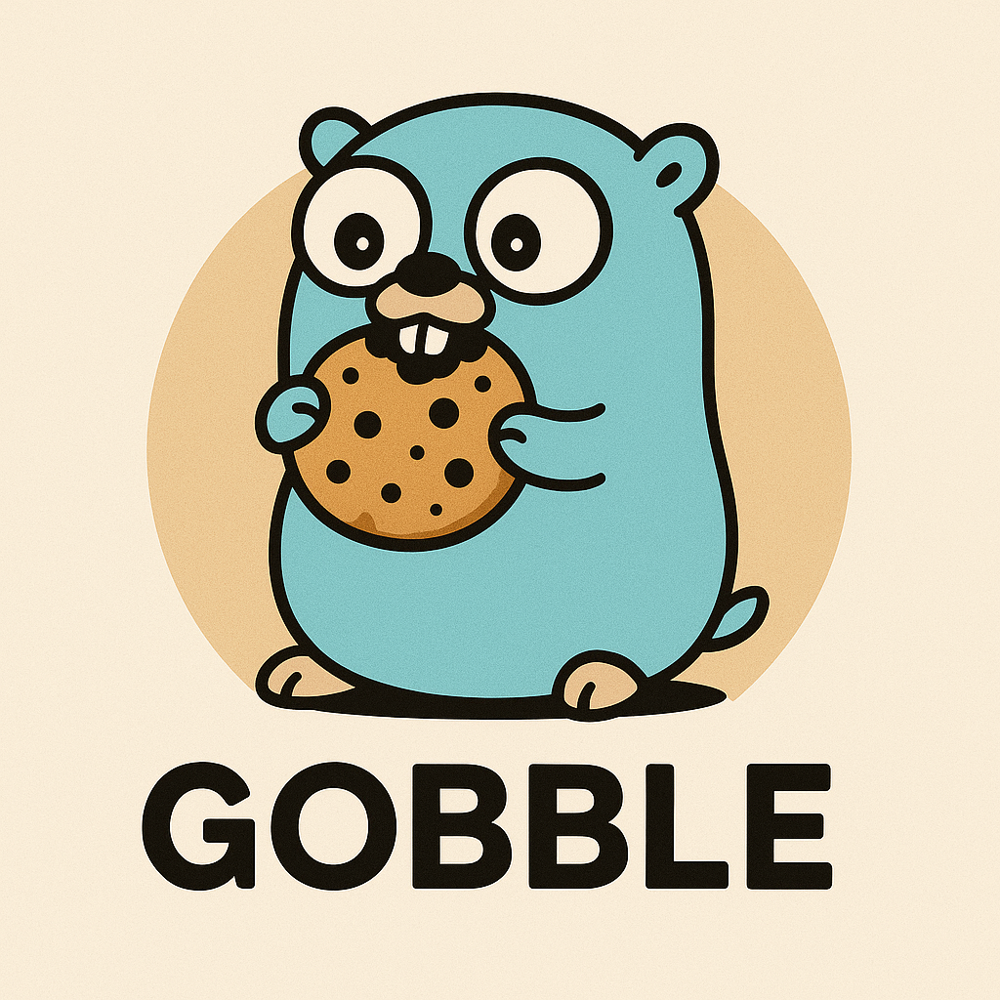
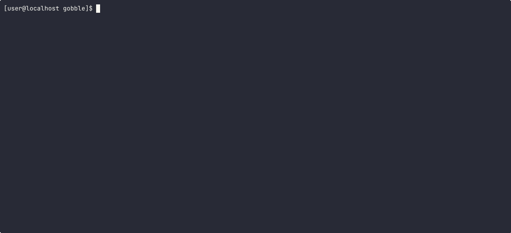

<p align="center">
 
</p>

Gobble will capture a pcap of tcp/udp network traffic from a command. No root or additional networking configuration required! (Only works on Linux). Inspired by [httptap](https://github.com/monasticacademy/httptap)/[tun2socks](https://github.com/xjasonlyu/tun2socks).

<p align="center">
  <a href="#features">Features</a> •
  <a href="#demo">Demo</a> •
  <a href="#installation">Installation</a> •
  <a href="#usage">Usage</a> •
  <a href="#description">Description</a> •
  <a href="#credits">Credits</a>
</p>

# Features

- **Root Is Not Required**: Grab that pcap as a normal user!
- **Zero Configuration**: No need to configure interfaces and manually add routes!
- **Uses GVisor's Network Stack**: Powered by [gVisor](https://github.com/google/gvisor).
- **Shows Connections**: Displays outbound connections that are created!

# Demo


# Installation
Download the statically linked binaries already compiled in the [Releases](https://github.com/tomis007/gobble/releases).

To build from source (the built binary will not be statically linked):
```bash
# install libpcap
# sudo apt install libpcap
# sudo pacman -S libpcap
# ... whatever your package manager is ...
#
$ go build cmd/gobble/gobble.go
```


# Usage
```
$ ./gobble --help
NAME:
   gobble - gobble network traffic

USAGE:
   gobble [global options] -- command

VERSION:
   0.1

GLOBAL OPTIONS:
   --verbose, -v               print debug output (default: false)
   --drop6, --no6              drop IPv6 connections (default: false)
   --drop4, --no4              drop IPv4 connections (default: false)
   --disablepcap, --nopcap     do not capture a pcap file (default: false)
   --silent, -s                silence gobble's info messages (default: false)
   --file string, -w string    output pcap file name (default: "captured.pcap")
   --filter string, -f string  eBPF filter for pcap like: "tcp and port 80"
   --help, -h                  show help
   --version, -V               print only the version (default: false)
```

To connect to services running on `localhost` use `240.0.0.1` for IPv4 or `[240::1]` for IPv6.

# Description
Gobble first creates a new user namespace (CLONE_NEWUSER) and runs itself again as a subprocess. Then Gobble creates a new Tun interface with gVisor (default routes are added for the interface), starts a PCAP capture on the created interface, and runs itself again as another subprocess. Gobble then returns to the original UID/GID that the chain started and finally executes the supplied command. The approach is the same as used in [httptap](https://github.com/monasticacademy/httptap) and similar to [tun2socks](https://github.com/xjasonlyu/tun2socks) and [oniux](https://gitlab.torproject.org/tpo/core/oniux).

# Credits
Gobble is similar to and very much inspired by the following projects:

- [tun2socks](https://github.com/xjasonlyu/tun2socks)    
- [httptap](https://github.com/monasticacademy/httptap)    
- [oniux](https://gitlab.torproject.org/tpo/core/oniux)   
